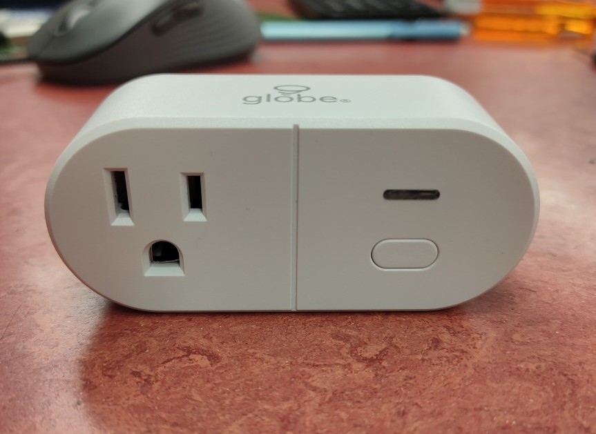
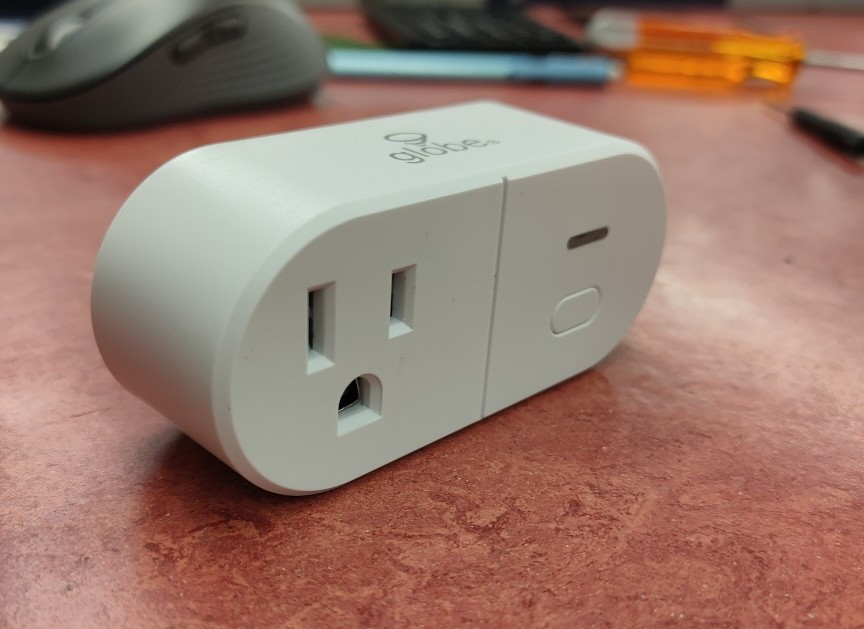
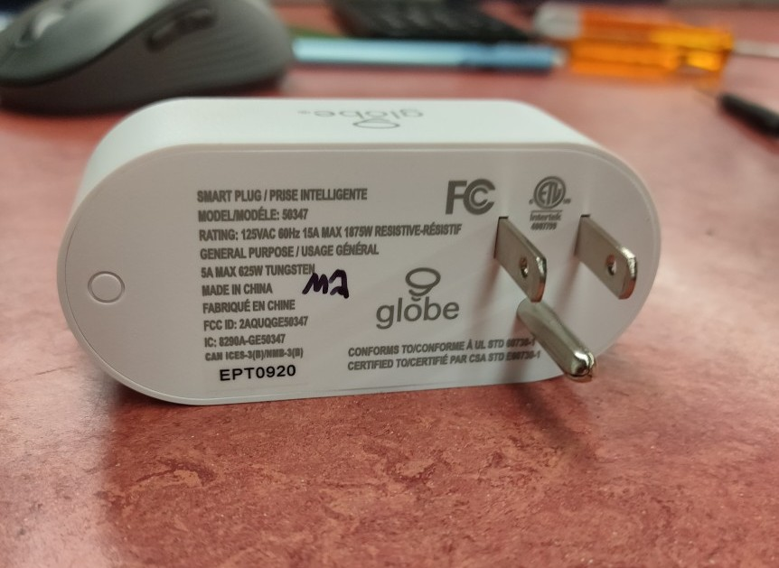

## Custom Firmware Needed

This device uses the WB2S module that comes with Tuya firmware, which can be flashed to esphome using cloudcutter following instructions [here](https://github.com/tuya-cloudcutter/tuya-cloudcutter/blob/main/INSTRUCTIONS.md)

## GPIO Pinout

Due to the fact that this uses a custom esphome firmware the pin numbers start with a P instead of the usual GPIO

| Pin | Function                             |
| --- | ------------------------------------ |
| P6  | Light                                |
| P7  | BL0937 CF pin                        |
| P8  | BL0937 CF1 pin                       |
| P24 | BL0937 SEL pin                       |
| P26 | Relay                                |
| P10 | Button                               |


## Basic Configuration

```yaml
# Globe Electric 50347 smart plug
substitutions:
  number: "1"
  device_name: globe-plug-${number}
  device_description: Globe Electric 50347 Smart plug
  friendly_name: Misc Plug ${number}

esphome:
  name: ${device_name}
  comment: ${device_description}

bk72xx:
  board: wb2s

# Enable logging
logger:

# Enable Home Assistant API
api:
  encryption:
    key: "YOUR KEY HERE"

web_server:
  port: 80
  auth:
    username: admin
    password: !secret web_server_password

ota:
  password: !secret ota_password 

wifi:
  ssid: !secret wifi_ssid
  password: !secret wifi_password

  # Enable fallback hotspot (captive portal) in case wifi connection fails
  ap:
    ssid: "Misc2 Fallback Hotspot"
    password: !secret ap_password

text_sensor:
  - platform: wifi_info
    ip_address:
      name: ESP IP Address
    ssid:
      name: ESP Connected SSID
    bssid:
      name: ESP Connected BSSID
    mac_address:
      name: ESP Mac Wifi Address

sensor:

  - platform: wifi_signal
    name: ${friendly_name} Signal
    update_interval: 60s

  - platform: hlw8012
    model: BL0937     # note that the model must be specified to use special calculation parameters
    sel_pin:          # I believe that cf_pin reports either Voltage or Current depending on this select pin
      inverted: true  # determine whether true reports Voltage
      number: P24
    cf_pin:           # current or voltage (ele_pin: 7)
      inverted: true  # the logic of BL0937 is opposite from HLW8012
      number: P7
    cf1_pin:          #  Power (vi_pin: 8)
      inverted: true  # the logic of BL0937 is opposite from HLW8012
      number: P8

    update_interval: 15s      # How often to measure and report values

    # PC191HA measures and returns Voltage OR Current according to the value of sel_pin,
    #   but it can change the value of sel_pin periodically  
    initial_mode: "VOLTAGE"       # reports VOLTAGE or CURRENT
    change_mode_every: 4          # how many times to report before swapping between
        #   reporting Voltage or Current. Note that the first value reported should be ignored as inaccurate

    # Adjust according to the actual resistor values on board to calibrate the specific unit
    voltage_divider:  872.357   # LOWER VALUE GIVES LOWER VOLTAGE - todo
    current_resistor: 0.0009  # HIGHER VALUE GIVES LOWER WATTAGE - todo

    #
    # how the power monitoring values are returned to ESPHome
    #

    voltage:
      name: ${device_name} Voltage
      id:   ${device_name}_voltage
      unit_of_measurement: V
      accuracy_decimals: 1
      filters:
        - skip_initial: 2
    power:
      name: ${device_name} Power
      id:   ${device_name}_power
      unit_of_measurement: W
      accuracy_decimals: 2
      filters:
        - skip_initial: 2

    # power should simply be current x voltage -- except that the pc191ha doesn't follow that formula.  
    # Setting current_resistor to give an accurate Amperage does NOT also give the correct Wattage
    # so here I calculate current from power and voltage

  - platform: template  
    name: ${device_name} Current
    id:   ${device_name}_current
    unit_of_measurement: A
    accuracy_decimals: 2
    update_interval: "20s"
    lambda: |-
      return (id(${device_name}_power).state / id(${device_name}_voltage).state);
    filters:  
      - skip_initial: 2

  - platform: uptime
    name: ${device_name} Uptime
    id:   ${device_name}_uptime
    update_interval: "30s"

light:
  - platform: status_led
    name: "led"
    internal: true
    id: led
    pin:
      number: P6
      inverted: true

binary_sensor:
  - platform: gpio
    pin:
      number: P10
      inverted: true
    id: button1
    filters:
      - delayed_on: 10ms
      - delayed_off: 10ms
    on_click:
      - switch.toggle: outlet

  - platform: status
    name: ${friendly_name} status

switch:
  - platform: gpio
    name: ${friendly_name} Outlet
    id: outlet
    pin: P26
    icon: mdi:power-socket-us
    on_turn_on:
      - light.turn_on: led
    on_turn_off:
      - light.turn_off: led

captive_portal:
    
```
